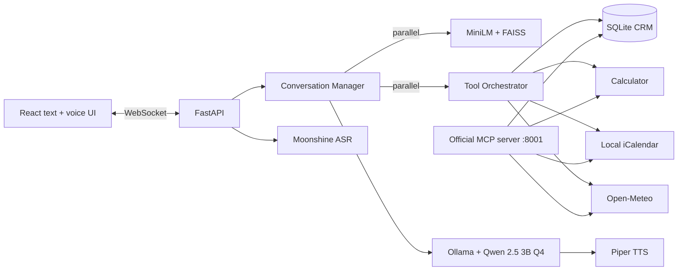

# SmartStay AI

SmartStay AI is a CPU-oriented hotel assistant with text and voice conversations, persistent guest profiles, grounded hotel-policy answers, and action tools. Assignment 3 adds a 50-document RAG pipeline, CRM, calculator, calendar, weather, and an official MCP server while preserving the previous FastAPI/WebSocket and browser contracts.

## Business use case

Hotel guests repeatedly ask policy questions, compare room costs, provide preferences, check travel weather, and place stay dates on their calendars. RAG grounds policy answers in the hotel's own documents instead of relying on model memory. CRM personalizes later sessions, while tools return deterministic prices, write calendar holds, and fetch time-sensitive weather.

## Architecture



For each turn, retrieval, guest-profile loading, and relevant tool calls start concurrently. Their results are bounded and inserted into one final prompt before Qwen streams tokens. Voice uses the same orchestration after Moonshine transcription and sends Piper WAV phrases while text is still arriving.

## Model selection

| Component | Selection | Reason |
|---|---|---|
| LLM | Qwen 2.5 3B Instruct Q4_K_M via Ollama | Strong small-model instruction following with laptop-scale quantized memory use |
| Embeddings | all-MiniLM-L6-v2 | 384-dimensional CPU-friendly semantic embeddings |
| ASR | Moonshine English | Local lightweight speech recognition |
| TTS | Piper | Fast local ONNX speech synthesis |

The LLM context is 4,096 tokens with output capped at 200 tokens. Actual tokens/second and peak RAM depend on the submission laptop and must be recorded with the benchmark procedure below; this repository does not invent those figures.

## Document collection and RAG

The repository contains exactly **50** domain documents in `knowledge_base/`, covering booking, payment, rooms, amenities, safety, and hotel policies.

- Rebuild command: `python -m rag.build_index`
- Chunks: 180 words with 30-word overlap
- Embedding model: `sentence-transformers/all-MiniLM-L6-v2`
- Vector store: persisted FAISS `IndexFlatIP`
- Similarity: cosine similarity through L2 normalization
- Retrieval: top-k = 3 (API permits 3–5)
- Cache: 128 normalized queries in process
- Context control: three passages capped at 900 characters and eight recent messages
- Citations: the prompt supplies filenames and requires `[source.txt]` citations

Generated index files under `data/index/` are ignored because they are reproducible and platform-dependent.

## Tools and MCP

The same async implementations are registered in-process for low latency and exposed through the [official MCP Python SDK](https://github.com/modelcontextprotocol/python-sdk) at `http://localhost:8001/mcp`.

| Tool | Purpose | Required schema fields | Example intent |
|---|---|---|---|
| `crm_profile` | Get/upsert a profile or record an interaction in SQLite | `action`, `user_id` | “My name is Ali and I prefer a quiet room.” |
| `calculate_room_cost` | Calculate deterministic stay pricing | `room_type`, `check_in`, `check_out` | “How much is a Deluxe room from 2026-05-01 to 2026-05-04?” |
| `create_calendar_event` | Write a local `.ics` stay hold | `user_id`, `room_type`, `check_in`, `check_out` | “Book a Suite from 2026-05-01 to 2026-05-04.” |
| `get_weather` | Fetch a city forecast from [Open-Meteo](https://open-meteo.com/en/docs) | `city` | “What is the weather in Islamabad on 2026-05-01?” |

Schemas are available at `GET /api/tools`. Calendar events are holds, not confirmed hotel reservations. Weather results are cached for ten minutes. Every call is validated, asynchronous, timed, and bounded by a timeout. The MCP example client is in `examples/mcp_client.py`.

## Real-time optimization

- RAG, CRM lookup, and relevant tool calls execute concurrently.
- Embedding models and FAISS are warmed during API startup.
- Repeated retrieval and weather queries use bounded caches.
- Blocking ASR, embeddings, FAISS startup, SQLite, file writes, and TTS run off the asyncio event loop.
- Preprocessing metrics are returned in each WebSocket `context` event.
- Per-session locks preserve order while different users continue concurrently.
- Tool errors are inserted into the prompt so generation can fail gracefully.

Run the measured preprocessing benchmark:

```bash
python benchmarks/rag_tools_latency.py
```

| Required measurement | Submission-machine result |
|---|---:|
| Average warm retrieval + tool preprocessing | _Run benchmark_ |
| Median warm preprocessing | _Run benchmark_ |
| Two-user concurrent preprocessing | _Run benchmark_ |
| Typical end-to-end LLM response | _Run live evaluation_ |
| Qwen tokens/second and peak RAM | _Run live evaluation_ |

The assignment target is under two seconds combined preprocessing. Use the emitted metrics and benchmark output to determine whether the submission laptop meets it.

## Setup

### 1. Clone and create the models

```bash
git clone https://github.com/Ali215666/SmartStay-AI.git
cd SmartStay-AI
ollama create smartstay-qwen -f Modelfile
```

Place a Piper `.onnx` voice and matching `.onnx.json` file in `models/` as described in the Assignment 2 setup.

### 2. Native development

```bash
python -m venv .venv
# Windows: .venv\Scripts\activate
# macOS/Linux: source .venv/bin/activate
pip install -r backend/requirements.txt
python -m rag.build_index
uvicorn backend.main:app --host 0.0.0.0 --port 8000
```

In separate terminals:

```bash
python -m tools.mcp_server
cd frontend && npm install && npm run dev
```

Environment variables:

| Variable | Default/purpose |
|---|---|
| `OLLAMA_BASE_URL` | `http://localhost:11434` |
| `OLLAMA_MODEL` | `smartstay-qwen` |
| `EMBEDDING_MODEL` | `sentence-transformers/all-MiniLM-L6-v2` |
| `CRM_DB_PATH` | `data/crm.sqlite3` |
| `PIPER_MODEL_PATH` | Required local `.onnx` path |
| `PIPER_CONFIG_PATH` | Matching voice configuration |

### 3. Docker Compose

```bash
docker compose -f backend/docker-compose.yml up --build
```

Compose builds the index once, starts the API on port 8000, starts MCP on port 8001, and persists indexes, CRM, and calendar files in named volumes. Ollama remains on the host for direct CPU access.

## APIs and testing

- `POST /api/chat`
- `POST /api/retrieve`
- `GET /api/tools`
- `WS /ws/chat`
- `WS /ws/voice`
- MCP Streamable HTTP: `http://localhost:8001/mcp`

Run deterministic tests and the frontend build:

```bash
python -m unittest tests.test_assignment_one tests.test_assignment_two tests.test_assignment_three
npm run build --prefix frontend
```

The Postman collection is `backend/Hotel_AI_Backend.postman_collection.json`.

## Known limitations

- First-time model download and cold loading are much slower than warm queries.
- The in-process RAG cache is per API worker.
- CRM and calendar use local disk; multi-host deployment needs shared storage.
- The intent router handles explicit dates in `YYYY-MM-DD` most reliably.
- Open-Meteo requires internet access and may time out.
- Calendar events do not prove hotel availability.
- English is the configured ASR language.
- The demo video and hardware benchmark values must be added from the submission machine.

## Cloud deployment

Cloud deployment was not attempted. The Docker split permits moving the API, MCP service, and persistent data independently, but free-tier CPU/RAM limits are likely to make the local Qwen, MiniLM, Moonshine, and Piper stack slower than the laptop deployment.

Additional design and evaluation notes are in [docs/assignment-three.md](docs/assignment-three.md).
