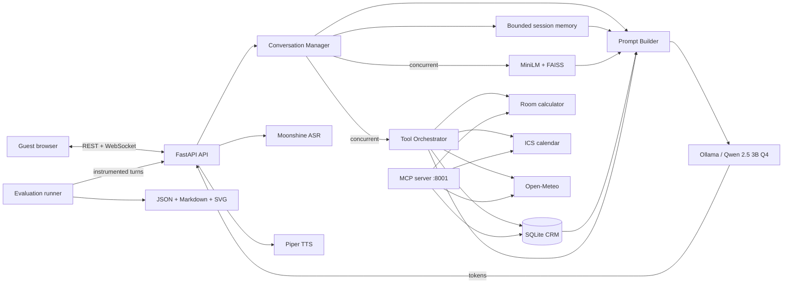

# SmartStay AI

SmartStay AI is a privacy-focused, locally deployed virtual hotel concierge that delivers natural, real-time assistance through both text and voice. Powered by a quantized open-weight language model, it maintains multi-turn conversation context, grounds hotel information in a curated knowledge base, remembers guest details through a persistent CRM, and safely handles practical requests such as room-cost estimates, calendar holds, and travel-weather checks. Its asynchronous FastAPI and WebSocket architecture supports streaming responses and concurrent guests on consumer CPU hardware, while the included evaluation suite measures conversational quality, retrieval accuracy, tool reliability, latency, throughput, and overall production readiness.


## Table of contents

1. [Project overview](#project-overview)
2. [Assignment progression](#assignment-progression)
3. [Business use case](#business-use-case)
4. [Features](#features)
5. [System architecture](#system-architecture)
6. [Request lifecycle](#request-lifecycle)
7. [Repository structure](#repository-structure)
8. [Technology and model choices](#technology-and-model-choices)
9. [Conversation management](#conversation-management)
10. [Retrieval-augmented generation](#retrieval-augmented-generation)
11. [CRM and tools](#crm-and-tools)
12. [Voice pipeline](#voice-pipeline)
13. [API contract](#api-contract)
14. [Comprehensive evaluation suite](#comprehensive-evaluation-suite)
15. [Evaluation datasets](#evaluation-datasets)
16. [Correctness metrics and formulas](#correctness-metrics-and-formulas)
17. [Latency, throughput, and concurrency](#latency-throughput-and-concurrency)
18. [Evaluation results](#evaluation-results)
19. [Prerequisites](#prerequisites)
20. [Local installation](#local-installation)
21. [Docker installation](#docker-installation)
22. [Running the application](#running-the-application)
23. [Running the evaluation](#running-the-evaluation)
24. [Testing and quality checks](#testing-and-quality-checks)
25. [Configuration reference](#configuration-reference)
26. [Deployment](#deployment)
27. [Security, privacy, and responsible use](#security-privacy-and-responsible-use)
28. [Failure handling](#failure-handling)
29. [Known limitations](#known-limitations)
30. [Troubleshooting](#troubleshooting)


## Project overview

SmartStay AI is a production-style conversational assistant for a hotel front desk. It runs its core language, speech recognition, speech synthesis, retrieval, customer data, and action logic locally. Guests can ask policy questions, continue a multi-turn conversation, save preferences, estimate room costs, create local calendar holds, request weather forecasts, and interact by text or voice.

The project emphasizes systems engineering over model training: prompt orchestration, bounded memory, asynchronous execution, WebSocket streaming, concurrency control, containerization, observability, and evidence-based evaluation. The final assignment adds a self-contained evaluation framework that measures whether the whole system works correctly and how it behaves under load.

The application does not train a model and does not use a paid cloud LLM API. Ollama serves a quantized open-weight model on the host CPU.

## Assignment progression

| Phase | Capability added | Important constraint or outcome |
|---|---|---|
| Assignment 1 | FastAPI, streaming chat, session memory, prompt orchestration, React UI, Docker | Local CPU inference; tools and RAG disallowed |
| Assignment 2 | Moonshine ASR, Piper TTS, streamed voice WebSocket, four-user voice capacity | Entire voice pipeline remains local and real time |
| Assignment 3 | 50-document RAG, SQLite CRM, calculator, calendar, weather, MCP server | Async retrieval and tools integrated without changing the chat contract |
| Assignment 4 | Annotated test sets, correctness metrics, latency trials, load testing, reports and graphs | One command evaluates the current system reproducibly |

Historical assignment notes remain in [`docs/`](docs/). The active architecture and commands in this README describe the final integrated system.

## Business use case

Hotel guests repeatedly ask the same high-value questions: when they can check in, whether a reservation is refundable, which rooms support accessibility needs, how much a stay costs, and what amenities are available. Staff must answer consistently while preserving a guest's stated preferences and keeping response time low.

SmartStay AI addresses that workflow as a virtual front-desk assistant:

- Hotel answers are grounded in the hotel's committed document collection.
- Guest identity and preferences can persist across sessions in SQLite.
- Deterministic calculations do not depend on an LLM doing arithmetic.
- Calendar actions create transparent local holds rather than pretending to confirm a booking.
- Travel-weather questions can use a live, free source when network access is available.
- The assistant stays within hotel operations and redirects unrelated requests.

The intended users are guests, front-desk staff during demonstrations, and engineers evaluating local conversational architectures. It is an academic prototype, not a property-management or payment system.

## Features

- Fully local, quantized LLM inference through Ollama.
- FastAPI REST and JSON WebSocket interfaces.
- Token-by-token response streaming.
- ChatGPT-style React interface with new-session support.
- Bounded, per-session multi-turn memory.
- Parallel retrieval, CRM lookup, and tool preparation.
- 50-document hotel knowledge base with a re-runnable indexer.
- CPU-friendly MiniLM embeddings and FAISS cosine search.
- Grounded answers with source filename citations.
- Persistent CRM create, read, update, delete, and interaction history.
- Deterministic room-cost calculator.
- Local iCalendar stay holds.
- Cached Open-Meteo forecast lookup.
- Official MCP server exposing the same four tools.
- Local Moonshine ASR and Piper TTS.
- Phrase-level TTS pipelining while text is still streaming.
- Explicit four-user voice capacity control.
- Docker Compose services for indexing, API, and MCP.
- Postman collection for key API contracts.
- 12 multi-turn dialogue scenarios, 30 RAG queries, and 24 tool-routing cases.
- Automated correctness, TTFT, inter-token, end-to-end, throughput, and concurrency reporting.
- JSON, Markdown, and SVG evaluation artifacts from one command.

## System architecture



Component responsibilities:

| Component | Responsibility |
|---|---|
| React frontend | Session-aware text and voice controls, streaming rendering, audio playback |
| FastAPI | Validation, REST routes, WebSocket lifecycle, error envelopes, health checks |
| Conversation manager | Turn ordering, concurrent preprocessing, prompt construction, streaming, interaction recording |
| Memory manager | Thread-safe, bounded recent history keyed by session ID |
| RAG module | Chunking, embedding, FAISS persistence, query cache, top-k retrieval |
| Tool orchestrator | Clear-intent detection, schema-valid arguments, concurrent async execution |
| Local LLM engine | Ollama streaming generation with the SmartStay model configuration |
| Voice pipeline | Browser audio conversion, local transcription, phrase synthesis and ordered playback |
| MCP server | Standards-based access to CRM, calculator, calendar, and weather functions |
| Evaluation suite | Fixed ground truth, live instrumentation, statistics, load generation, report output |

## Request lifecycle

### Text turn

1. The browser sends `session_id`, `user_id`, and `message` to `/ws/chat`.
2. FastAPI validates message length and associates the socket with a session.
3. The conversation manager starts relevant retrieval and tool work concurrently; a CRM profile lookup can run alongside them.
4. Simple conversational turns bypass retrieval through a transparent hotel-domain keyword gate.
5. The prompt builder combines policy instructions, a safe CRM projection, at most three retrieved passages, tool results, eight recent messages, and the current request.
6. Ollama streams model output. FastAPI forwards each fragment as a `token` event.
7. The completed user and assistant turns enter bounded memory, and a short interaction is stored in CRM.

### Voice turn

1. The browser sends `audio_start`, one binary recording, then `audio_end` to `/ws/voice`.
2. FFmpeg converts the recording to 16 kHz mono WAV.
3. Moonshine transcribes locally and emits a `transcript` event.
4. The transcript follows the same conversation path as text.
5. Tokens stream immediately; complete phrases enter a Piper TTS queue.
6. Ordered base64 WAV chunks play in the browser while later text is still generated.
7. The final event includes ASR, first-token, first-audio, and total timing where available.

## Repository structure

```text
SmartStay-AI/
|-- backend/                 FastAPI routes, voice pipeline, Docker files, Postman collection
|-- benchmarks/              Focused RAG/tool and voice latency scripts
|-- conversation/            Session, memory, and prompt orchestration
|-- docs/                    Assignment history and evaluation methodology
|-- evals/                   Final-assignment datasets, evaluators, runner, and reporting
|   `-- datasets/            Conversations, RAG ground truth, tool invocation ground truth
|-- examples/                MCP client example
|-- frontend/                React + Vite chat and voice interface
|-- knowledge_base/          50 hotel-domain source documents
|-- llm/                     Async Ollama streaming client
|-- rag/                     Index builder, chunker, embeddings, vector store, retriever
|-- tests/                   Assignment and final-suite offline regression tests
|-- tools/                   CRM, calculator, calendar, weather, registry, MCP server
|-- Modelfile                Quantized Qwen runtime configuration
|-- evaluate.py              One-command final evaluation entry point
`-- requirements-eval.txt    Evaluation-only runtime dependencies
```

Generated and machine-specific files are intentionally ignored: `data/`, `calendars/`, `models/`, `eval_reports/`, frontend build output, virtual environments, and caches.

## Technology and model choices

| Layer | Selection | Rationale |
|---|---|---|
| LLM | Qwen 2.5 3B Instruct Q4_K_M | Small instruction model with laptop-scale quantized memory requirements |
| Serving | Ollama | Simple local model lifecycle and streaming HTTP API |
| Embeddings | `sentence-transformers/all-MiniLM-L6-v2` | 384-dimensional, CPU-friendly semantic representation |
| Vector search | FAISS `IndexFlatIP` | Exact, fast local search without a remote database |
| ASR | Moonshine English | Lightweight offline speech recognition |
| TTS | Piper | Fast local ONNX synthesis suitable for incremental phrases |
| API | FastAPI + Uvicorn | Async HTTP/WebSocket support and schema validation |
| Frontend | React 18 + Vite | Small interactive client with efficient local development |
| CRM | SQLite | Durable local storage, transactional writes, no service dependency |
| Tools protocol | Official MCP Python SDK | Standards-compatible exposure of typed local functions |
| Evaluation | Python standard library + WebSockets + psutil | Reproducible metrics with few additional dependencies |

The [`Modelfile`](Modelfile) configures a 4,096-token context, at most 200 generated tokens, temperature `0.30`, top-p `0.85`, and automatic CPU thread selection. Actual tokens per second, memory use, and response latency are hardware-dependent and must come from a fresh full evaluation.

## Conversation management

`MemoryManager` keeps at most 12 sanitized messages per session and returns copies under a thread lock. The prompt uses the most recent eight messages to leave space for retrieved evidence and output. A session lock prevents overlapping turns from corrupting order while unrelated sessions execute concurrently.

The system prompt defines:

- hotel-only scope;
- the exact out-of-domain refusal;
- retrieved documents as the policy authority;
- tool outputs as structured facts;
- filename citations for grounded claims;
- reservation fields to gather naturally;
- the rule that calendar holds are not confirmed bookings;
- concise, professional tone and first-turn-only greeting.

Session history is intentionally ephemeral in the backend. Cross-session guest details reside in the CRM only when captured by an appropriate user message.

## Retrieval-augmented generation

The repository includes exactly 50 plain-text hotel documents covering rooms, bookings, payments, services, amenities, safety, accessibility, and local information.

| Setting | Value |
|---|---|
| Corpus size | 50 documents |
| Chunk size | 180 words |
| Chunk overlap | 30 words |
| Embedding size | 384 dimensions |
| Index | FAISS exact inner product |
| Similarity | Cosine, implemented through L2 normalization |
| Default retrieval | top-k = 3 |
| API range | 3 to 5 |
| Query cache | 128 normalized queries per process |
| Prompt cap | 3 passages, 900 characters each |
| Citation form | `[document_filename.txt]` |

Build or rebuild the index after any document change:

```bash
python -m rag.build_index
```

The generated index and metadata are written below `data/index/`. They are reproducible and are not committed. Retrieval uses a keyword gate for conversational or tool-only turns; the dedicated `/api/retrieve` endpoint always performs retrieval when called.

## CRM and tools

All tools use one registry, typed JSON schemas, async interfaces, timeouts, and normalized result envelopes. The conversation manager calls them directly for minimal latency. The MCP server exposes the same implementations at `http://localhost:8001/mcp`.

### `crm_profile`

Purpose: persist guest name, contact information, preferences, and recent interactions.

```json
{
  "action": "upsert",
  "user_id": "guest-42",
  "name": "Sara Khan",
  "preference": "quiet room"
}
```

Supported actions are `get`, `upsert`, `delete`, and `record_interaction`. Preferences are deduplicated and bounded; returned interactions are limited to recent records.

### `calculate_room_cost`

Purpose: deterministically calculate a stay from room type, ISO check-in/check-out dates, and guest count.

```json
{
  "room_type": "Deluxe",
  "check_in": "2026-06-01",
  "check_out": "2026-06-04",
  "guests": 2
}
```

The function validates the room, date order, and guest capacity. Its result is an estimate, not a charge or availability confirmation.

### `create_calendar_event`

Purpose: write a local `.ics` hold for requested stay dates.

```json
{
  "user_id": "guest-42",
  "room_type": "Suite",
  "check_in": "2026-07-10",
  "check_out": "2026-07-12",
  "guest_name": "Sara Khan"
}
```

Files are written below `calendars/`. The tool never claims to update hotel inventory.

### `get_weather`

Purpose: obtain a current or upcoming daily forecast for a city through Open-Meteo.

```json
{
  "city": "Islamabad",
  "date": "2026-07-20"
}
```

Results are cached for ten minutes. Invalid dates fail without a network request. Network, location, and forecast-window errors return guest-safe failures.

List the authoritative schemas with `GET /api/tools`. Try the MCP protocol with:

```bash
python examples/mcp_client.py
```

## Voice pipeline

Voice remains local end to end. The browser records audio, FFmpeg normalizes it, Moonshine returns text, Qwen generates the answer, and Piper synthesizes it. Blocking model work is moved off the asyncio event loop. A semaphore limits active voice turns to four to avoid CPU collapse; excess requests wait instead of corrupting existing streams.

Required model files are deliberately excluded from Git because they are large. Set `PIPER_MODEL_PATH` and `PIPER_CONFIG_PATH` to the downloaded voice and matching JSON configuration. `GET /health/voice` reports FFmpeg, Moonshine, Piper, and model readiness separately.

## API contract

### REST endpoints

| Method | Path | Purpose |
|---|---|---|
| `GET` | `/` | Service identity |
| `GET` | `/health` | API, architecture, RAG, tools, MCP summary |
| `GET` | `/health/voice` | Voice dependency readiness |
| `POST` | `/api/chat` | Non-streaming JSON chat convenience endpoint |
| `POST` | `/api/retrieve` | Direct top-k retrieval for evaluation/debugging |
| `GET` | `/api/tools` | Registered tool schemas |
| `DELETE` | `/api/sessions/{session_id}` | Clear in-memory conversation history |
| `WS` | `/ws/chat` | Streaming text conversation |
| `WS` | `/ws/voice` | Audio input, transcript, text, and audio output |

Text WebSocket request:

```json
{
  "session_id": "browser-session-1",
  "user_id": "guest-42",
  "message": "What is the cancellation policy?"
}
```

Text event order:

```text
start -> context -> token ... token -> done
```

The `context` event includes retrieved source metadata, executed tool results, preprocessing timings, and non-fatal retrieval/tool errors. A fatal turn failure emits `error`.

The Postman collection is [`backend/Hotel_AI_Backend.postman_collection.json`](backend/Hotel_AI_Backend.postman_collection.json).

## Comprehensive evaluation suite

The final assignment evaluates the chatbot as an integrated system rather than presenting hand-picked demo conversations. The suite is dependency-light, deterministic where possible, and transparent about its heuristics.

One run can evaluate:

- multi-turn task completion, policy adherence, and conversational coherence;
- RAG precision@3, recall@3, mean reciprocal rank, and context relevance;
- faithfulness, expected answer terms, and citation behavior over 30 QA pairs;
- CRM create/read/update/delete behavior;
- calculator, calendar, and weather validation behavior;
- correct tool selection, argument extraction, and negative-case false positives;
- TTFT, mean inter-token gap, and end-to-end response latency;
- simple, RAG-only, tool-only, and mixed requests;
- multiple concurrent users, turns per second, error rate, sustainable level, and breakpoint;
- hardware, operating system, Python, and key dependency versions;
- per-case outputs and runner-level failures.

The detailed and stable rationale is in [`docs/evaluation-methodology.md`](docs/evaluation-methodology.md).

## Evaluation datasets

| Dataset | Count | What is annotated |
|---|---:|---|
| Multi-turn dialogues | 12 dialogues / 24 turns | Content terms, required source/tool, refusal behavior, later-turn memory terms |
| RAG ground truth | 30 queries | Relevant filenames and expected answer concepts |
| Faithfulness set | 30 QA responses | Retrieved contexts and generated claims from the same RAG queries |
| Tool invocation set | 24 prompts | Expected tool, exact argument subset, and no-tool negative cases |
| Knowledge corpus | 50 documents | Hotel-domain source text used by indexing and retrieval |

The runner validates minimum counts, global ID uniqueness, multi-turn structure, and every annotated source filename before running live tests. Ground truth is committed under [`evals/datasets/`](evals/datasets/) so results are comparable across machines and code changes.

## Correctness metrics and formulas

Let `R_k` be the first `k` retrieved filenames and `G` the annotated relevant set.

```text
precision@k = |R_k intersection G| / k
recall@k    = |R_k intersection G| / |G|
RR(q)       = 1 / rank of the first relevant result, or 0 if none is returned
MRR         = mean RR across all queries
```

Context relevance uses precision@3. Answer coverage is the fraction of annotated answer terms found in the final answer. Citation rate is the fraction of answers containing a relevant `[source.txt]` marker.

Faithfulness uses an inspectable lexical proxy. Each answer is split into claims; a claim is supported when at least 45% of its content tokens occur in retrieved context. The metric is:

```text
faithfulness = supported claims / evaluated claims
```

This avoids using a remote judge model, which would violate the local-system goal. It can penalize valid paraphrases, so low scores must be reviewed in the JSON evidence rather than treated as an absolute truth.

Dialogue task completion requires every expectation in a dialogue to pass. Policy adherence checks exact domain redirection for unrelated requests and guards against spurious refusals. Coherence is the fraction of annotated earlier-turn facts present in later responses.

Tool selection accuracy covers all routing cases. Argument accuracy covers positive cases. False-positive rate is computed only over prompts annotated with no tool:

```text
false-positive rate = negative prompts with a tool call / all negative prompts
```

## Latency, throughput, and concurrency

The default performance run executes 30 trials for each required scenario:

| Scenario | Example | Expected preprocessing |
|---|---|---|
| Simple | “Please briefly introduce SmartStay AI.” | No RAG, no action tool |
| RAG-only | Cancellation-policy question | Retrieval only |
| Tool-only | Room cost with ISO dates | Calculator only |
| Mixed | Cancellation explanation plus room estimate | Retrieval and calculator |

Timing definitions:

- **TTFT:** WebSocket send to first `token` event.
- **Inter-token latency:** arithmetic mean of adjacent token arrival gaps.
- **End-to-end:** WebSocket send through the `done` event.
- **Throughput:** successful and failed completed turns divided by wall-clock load-test duration.

Every latency distribution reports count, mean, median, p90, p99, minimum, maximum, and a normal-approximation 95% confidence interval for the mean.

Concurrency runs at 1, 2, 4, 6, and 8 users by default. Each user owns a session and sends three sequential turns while users run concurrently. A level is considered sustainable when:

```text
error rate <= 5%
median TTFT <= 2,000 ms
median end-to-end <= 10,000 ms
```

The largest passing level is reported as maximum sustainable concurrency; the first failing level is the observed breakpoint. These are explicit evaluation thresholds, not guarantees for other hardware.

## Evaluation results

Measured LLM and live RAG results are intentionally not fabricated or copied from a different machine. Run the complete suite on the final submission laptop with Ollama warmed, then retain `eval_reports/` and fill the verified values below.

| Correctness result | Submission-machine value |
|---|---:|
| Dialogue task completion | _Run `python evaluate.py`_ |
| Policy adherence | _Run full evaluation_ |
| Mean conversational coherence | _Run full evaluation_ |
| Precision@3 / Recall@3 / MRR | _Run full evaluation_ |
| Faithfulness / context relevance / citation rate | _Run full evaluation_ |
| Tool selection / argument accuracy / false positives | _Run full evaluation_ |

| Performance result | Submission-machine value |
|---|---:|
| Simple median TTFT / p99 E2E | _Run full evaluation_ |
| RAG-only median TTFT / p99 E2E | _Run full evaluation_ |
| Tool-only median TTFT / p99 E2E | _Run full evaluation_ |
| Mixed median TTFT / p99 E2E | _Run full evaluation_ |
| Maximum sustainable users | _Run full evaluation_ |
| Breakpoint and turns/second | _Run full evaluation_ |

Offline suite validation on the development checkout verifies the committed dataset structure, metrics, report generation, CRM CRUD, local tool behavior, and router annotations. This is not a substitute for the live 30-trial run.

How to interpret the output:

- Prefer p90 and p99 when discussing user experience; a low mean can conceal stalls.
- Treat missing live metrics as a failed or skipped run, never as zero latency.
- Inspect `evaluation.json` for exact failed prompts, retrieved sources, calls, arguments, and errors.
- A precision/recall trade-off may justify changing top-k, but larger context consumes prompt budget.
- A routing improvement must be checked against negative-case false positives.
- Compare performance only when hardware, model, quantization, warm-up, trial count, and thresholds are disclosed.

## Prerequisites

- 64-bit laptop with a modern multi-core CPU; 16 GB RAM recommended.
- Python 3.11 or 3.12.
- Node.js 18 or newer and npm.
- Ollama with access to the `qwen2.5:3b-instruct-q4_K_M` base model.
- FFmpeg for voice input conversion.
- Git.
- Optional: Docker Desktop with Compose.
- Piper English voice `.onnx` file and matching `.onnx.json` for speech output.
- Microphone permission in a modern browser for voice interaction.

No cloud LLM key is required. The weather tool requires outbound internet only when a live forecast is requested.

## Local installation

### 1. Clone

```bash
git clone https://github.com/Ali215666/SmartStay-AI.git
cd SmartStay-AI
```

### 2. Create and activate a virtual environment

Linux/macOS:

```bash
python -m venv .venv
source .venv/bin/activate
```

Windows PowerShell:

```powershell
py -m venv .venv
.venv\Scripts\Activate.ps1
```

### 3. Install backend and evaluation dependencies

```bash
python -m pip install --upgrade pip
pip install -r backend/requirements.txt
pip install -r requirements-eval.txt
```

### 4. Create the local Ollama model

```bash
ollama pull qwen2.5:3b-instruct-q4_K_M
ollama create smartstay-qwen -f Modelfile
ollama run smartstay-qwen "Introduce yourself in one sentence."
```

### 5. Configure voice files

Place the Piper model and JSON configuration in `models/`, then set environment variables. Example for Linux/macOS:

```bash
export PIPER_MODEL_PATH="$PWD/models/en_US-lessac-medium.onnx"
export PIPER_CONFIG_PATH="$PWD/models/en_US-lessac-medium.onnx.json"
```

PowerShell:

```powershell
$env:PIPER_MODEL_PATH = "$PWD\models\en_US-lessac-medium.onnx"
$env:PIPER_CONFIG_PATH = "$PWD\models\en_US-lessac-medium.onnx.json"
```

### 6. Build the knowledge index

```bash
python -m rag.build_index
```

### 7. Install the frontend

```bash
cd frontend
npm install
cd ..
```

## Docker installation

Ollama runs on the host so the API container can use the host's CPU model service. From the repository root:

```bash
ollama create smartstay-qwen -f Modelfile
docker compose -f backend/docker-compose.yml build
docker compose -f backend/docker-compose.yml up
```

Compose runs:

- `indexer`: builds the persisted FAISS index, then exits successfully;
- `api`: serves FastAPI at `http://localhost:8000`;
- `mcp`: serves MCP at `http://localhost:8001/mcp`.

Named volumes persist the index/CRM and calendar files. `models/` is mounted read-only. The container calls host Ollama through `host.docker.internal:11434`.

## Running the application

Use three terminals after the model and index exist.

Terminal 1 — API:

```bash
uvicorn backend.main:app --host 0.0.0.0 --port 8000
```

Terminal 2 — MCP server:

```bash
python -m tools.mcp_server
```

Terminal 3 — frontend:

```bash
cd frontend
npm run dev
```

Open `http://localhost:5173`. Confirm `http://localhost:8000/health` first. The frontend defaults to `ws://localhost:8000/ws/chat` and `ws://localhost:8000/ws/voice`.

## Running the evaluation

Start and warm Ollama and the FastAPI server, then execute the required comprehensive run from the repository root:

```bash
python evaluate.py
```

Generated artifacts:

| Artifact | Contents |
|---|---|
| `eval_reports/evaluation.json` | Complete machine-readable environment, aggregate metrics, per-case evidence, timings, and failures |
| `eval_reports/evaluation.md` | Human-readable summary tables and interpretation |
| `eval_reports/latency.svg` | Median end-to-end latency graph by scenario |

Useful modes:

```bash
# Dataset, CRM, local tool, routing, and report validation; API not required
python evaluate.py --mode validate

# Short live smoke test; never use its tiny sample as final evidence
python evaluate.py --quick

# Full correctness only
python evaluate.py --mode correctness

# Full latency and load test only
python evaluate.py --mode performance

# Include a real Open-Meteo success check
python evaluate.py --network-tools

# Explicit server locations and output directory
python evaluate.py --base-url http://localhost:8000 \
  --ws-url ws://localhost:8000/ws/chat \
  --output-dir eval_reports
```

The default full run can take substantial time on a CPU because it generates many real LLM responses. Keep the machine on AC power, close competing workloads, warm the model once, and do not use `--quick` for submitted metrics.

## Testing and quality checks

Run all tracked offline assignment tests:

```bash
python -m unittest \
  tests.test_assignment_one \
  tests.test_assignment_two \
  tests.test_assignment_three \
  tests.test_evaluation_suite
```

Run only the final-suite regression tests:

```bash
python -m unittest tests.test_evaluation_suite
```

Check syntax:

```bash
python -m compileall backend conversation evals llm rag tools tests evaluate.py
```

Build the production frontend:

```bash
cd frontend
npm run build
```

Focused component benchmarks remain available:

```bash
python benchmarks/rag_tools_latency.py
python benchmarks/voice_latency.py
```

Docker verification, when Docker is installed:

```bash
docker compose -f backend/docker-compose.yml config
docker compose -f backend/docker-compose.yml build
```

## Configuration reference

### Application

| Variable | Default | Purpose |
|---|---|---|
| `OLLAMA_BASE_URL` | `http://localhost:11434` | Ollama server |
| `OLLAMA_MODEL` | `smartstay-qwen` | Local model name |
| `CRM_DB_PATH` | `data/crm.sqlite3` | Persistent CRM database |
| `PIPER_MODEL_PATH` | empty | Piper `.onnx` voice path |
| `PIPER_CONFIG_PATH` | model path plus `.json` | Piper voice configuration |
| `PIPER_LENGTH_SCALE` | `1.0` | Speech pace control |
| `MCP_PORT` | `8001` | MCP HTTP port |
| `VITE_WS_URL` | `ws://localhost:8000/ws/chat` | Frontend text socket at build time |
| `VITE_VOICE_WS_URL` | `ws://localhost:8000/ws/voice` | Frontend voice socket at build time |

### Evaluation

| Variable | Default | Purpose |
|---|---|---|
| `SMARTSTAY_BASE_URL` | `http://localhost:8000` | REST API under evaluation |
| `SMARTSTAY_WS_URL` | `ws://localhost:8000/ws/chat` | Streaming text endpoint |
| `SMARTSTAY_EVAL_OUTPUT` | `eval_reports` | Generated report directory |
| `SMARTSTAY_LATENCY_TRIALS` | `30` | Trials per latency scenario |
| `SMARTSTAY_CONCURRENCY` | `1,2,4,6,8` | Concurrent user levels |
| `SMARTSTAY_MAX_TTFT_MS` | `2000` | Sustainable median TTFT threshold |
| `SMARTSTAY_MAX_E2E_MS` | `10000` | Sustainable median E2E threshold |
| `SMARTSTAY_EVAL_TIMEOUT` | `120` | Per-turn timeout in seconds |

Command-line values override the applicable evaluation URL, output, and trial settings.

## Deployment

The React frontend is compatible with Vercel. Before building it there, configure `VITE_WS_URL` and `VITE_VOICE_WS_URL` to public secure `wss://` endpoints. The FastAPI/Ollama backend cannot run in a Vercel serverless function: it requires persistent processes, WebSockets, model memory, local files, and CPU time. Host the backend on a suitable VM/container platform or expose the local demonstration server through an approved secure tunnel.

Production deployment also requires:

- an HTTPS/WSS reverse proxy;
- explicit CORS origins instead of localhost-only configuration;
- authentication and per-user authorization;
- rate and payload limits at the edge;
- durable encrypted storage and backups;
- secrets management;
- health monitoring and log retention;
- a clear policy for external weather traffic.

Submission URLs are listed in [Project team and links](#project-team-and-links). Replace placeholders only after the services and video have been verified.

## Security, privacy, and responsible use

- The backend validates message and audio sizes.
- Tool schemas reject unexpected or malformed arguments.
- SQLite queries use parameters rather than string interpolation.
- The prompt receives only a safe CRM projection, not the entire database.
- Calendar filenames are generated by application logic and remain local.
- Model, ASR, TTS, retrieval, CRM, and calculator data remain local.
- Weather requests send the requested city to Open-Meteo when invoked.
- The assistant must not claim a confirmed booking, take payment, or provide emergency guarantees.
- CRM delete support exists for evaluation and data lifecycle handling.

This academic prototype has no authentication. Never expose it publicly with real guest personal data in its present form.

## Failure handling

| Failure | Behavior |
|---|---|
| Ollama unavailable | Turn emits a clear server error rather than a fabricated answer |
| Missing RAG index | Retrieval reports that `rag.build_index` must run |
| Retrieval failure during chat | Error enters context; other turn work can continue |
| Tool validation/runtime failure | Structured failure is supplied to the model for an honest explanation |
| Weather timeout/network failure | Guest-safe unavailable response; no stale invention |
| Invalid/oversized chat message | WebSocket `error` event |
| Oversized/empty voice recording | Voice `error` event without processing |
| TTS failure | Text remains available and `audio_error` is emitted |
| Socket interruption | Frontend performs bounded reconnection attempts |
| Evaluation API unavailable | Offline checks still report; live sections are skipped and the command exits non-zero |

## Known limitations

- A 3B quantized model can misunderstand nuanced requests or ignore citation formatting.
- The lexical faithfulness metric can mark correct paraphrases as unsupported; human review remains necessary.
- Keyword-based intent and retrieval gating is transparent and fast but less flexible than learned routing.
- The exact FAISS search uses a small corpus well; a much larger corpus would need different indexing and evaluation.
- Conversation memory is in-process and disappears after restart; CRM is persistent but is not a complete chat transcript store.
- SQLite is suitable for a local demonstration, not high-write distributed deployment.
- The calculator uses fixed prototype rates and does not query availability, seasonal inventory, taxes, or a payment service.
- Calendar output is a local hold, not a hotel reservation.
- Open-Meteo needs internet access and only supports its available forecast window.
- Voice accepts a completed browser recording rather than true frame-by-frame ASR streaming.
- The default concurrency test measures the text pipeline after transcription, not simultaneous microphone capture.
- CPU latency is sensitive to power mode, thermal throttling, model warm-up, and competing processes.
- CORS is currently configured for the local Vite origin.
- The repository does not include large ASR/TTS model artifacts or generated indexes.
- No authentication, authorization, payment, audit, or property-management integration is provided.

## Troubleshooting

### `RAG index is missing`

Run `python -m rag.build_index` from the repository root and verify `data/index/` is writable.

### Ollama connection fails

Run `ollama list`, confirm `smartstay-qwen` exists, start Ollama, and check `OLLAMA_BASE_URL`. Containers use `http://host.docker.internal:11434`.

### The browser connects to the wrong server

Set `VITE_WS_URL` and `VITE_VOICE_WS_URL` before `npm run build`. Vite substitutes them at build time.

### Voice health is not ready

Install FFmpeg and Python voice dependencies, set both Piper paths, then inspect `GET /health/voice` for the exact missing component.

### Weather tests are skipped

That is expected in default offline validation. Use `python evaluate.py --network-tools` when outbound network access is available.

### Evaluation reports no live metrics

Start Ollama and FastAPI, confirm `/health` returns healthy, then rerun without `--mode validate`. An unreachable API produces a runner-level failure and non-zero exit.

### Latency varies between runs

Warm the model and RAG index, use the same power plan, close background workloads, keep all defaults, and compare p90/p99 with the recorded hardware metadata.

## Demo plan

The assignment video should be no longer than five minutes. A concise sequence is:

1. Show the architecture and `/health` output.
2. Ask a hotel policy question and point out its source citation.
3. Introduce a guest name/preference, start a new session with the same user ID, and demonstrate CRM recall.
4. Request a room-cost calculation and calendar hold.
5. Demonstrate a voice question and streamed spoken response.
6. Run `python evaluate.py --quick` only to show the interface, then open a previously completed full `evaluation.md` and `latency.svg`.
7. State the measured task, RAG, tool, p90/p99, and concurrency results along with the test machine.

Do not present quick-mode numbers as the final 30-trial evaluation.

## Submission checklist

- [x] FastAPI source and text/voice WebSockets.
- [x] React web interface with streaming and session reset.
- [x] Local quantized LLM configuration.
- [x] Local ASR and TTS integration.
- [x] 50-document RAG corpus and re-runnable indexer.
- [x] CRM plus three additional async tools.
- [x] MCP server.
- [x] Dockerfile and Compose deployment.
- [x] Postman collection.
- [x] At least 10 multi-turn test dialogues.
- [x] 20–30 retrieval queries and at least 30 faithfulness QA pairs.
- [x] Functional and invocation tests for all tools.
- [x] Four latency scenarios with 30-trial defaults.
- [x] Concurrent load levels, throughput, maximum sustainable level, and breakpoint.
- [x] One-command JSON, Markdown, SVG, environment, and failure reporting.
- [x] Extensive README with setup, formulas, assumptions, limitations, and interpretation.
- [ ] Run the full suite on the final submission machine and retain `eval_reports/`.
- [ ] Replace the Vercel URL placeholder with the verified deployment.
- [ ] Record the under-five-minute demo and replace the video placeholder.
- [ ] Confirm all group-member names and student IDs.

## Project team and links

| Item | Value |
|---|---|
| Project | SmartStay AI |
| Repository | [github.com/Ali215666/SmartStay-AI](https://github.com/Ali215666/SmartStay-AI) |
| Group member | Muhammad Nade Ali — `i230116@isb.nu.edu.pk` |
| Additional group member(s) | _Add teammate name(s) and student ID(s) before submission_ |
| Vercel deployment | _Add verified Vercel URL before submission_ |
| Demo video, maximum 5 minutes | _Add verified video URL before submission_ |

---

SmartStay AI was developed as a multi-assignment conversational systems project. Reproduce and disclose measured results, hardware, model settings, and remaining failures when submitting or extending it.
